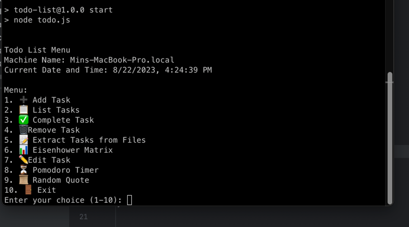

# 📋 Task Management App



A command-line task manager built with Node.js. Organize tasks, set priorities, and use a Pomodoro Timer for productivity.

## Features

- ✅ Add, complete, and remove tasks.
- 📅 Set due dates, priorities, and tags.
- 📝 Edit task details.
- 📚 Extract tasks from code files.
- 📊 Organize with the Eisenhower Matrix.
- ⏳ Start Pomodoro timers.
- 📜 Get random quotes for inspiration.

## Usage

1. Clone this repo:

   ```shell
   git clone https://github.com/minmyatoo/node-todo.git
   ```

2. Install dependencies:

   ```shell
   npm install
   ```

3. Start the app:

   ```shell
   node todo.js
   ```

Follow on-screen prompts to manage tasks.

## License

This project is licensed under the MIT License - see [LICENSE.md](LICENSE.md).
